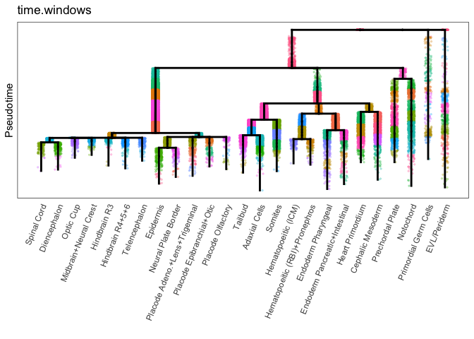

Step1: Define Enriched Genes in Cell Types of Interest
================
Yiqun Wang

In this step, we will identify genes that are enriched in the zebrafish
notochord and hatching gland during specification and differentiation.
Enriched genes are defined as the ones that show stronger expression in
the notochord and hatching gland compared to other cell types. Two
single-cell RNA-seq datasets will be used here: 1. whole embryo data
from 3-12hpf, and 2. anterior embryo data from 14-24hpf.

We document our process of finding enriched genes in our data, but the
specific methods for finding enriched genes can vary with different
input data. Regardless of the data and methods used, the necessary end
products of this step are a list of enriched genes for each tissue of
interest, as well as the enriched genes by pseudotime expression matrix.

``` r
source("../functions/enriched_gene_identification.R")
```

    ## Loading required package: URD

    ## Loading required package: ggplot2

    ## Loading required package: Matrix

    ## Registered S3 method overwritten by 'gplots':
    ##   method         from 
    ##   reorder.factor gdata

## 0.1 Define enriched genes from the whole embryo dataset

This dataset is from [Farrell et
al. 2018](https://pubmed.ncbi.nlm.nih.gov/29700225/). Single-cell
transcriptomes have been assembled into developmental trajectories using
the [URD package](https://github.com/farrellja/URD).

### 0.1.1 Load data

``` r
suppressPackageStartupMessages(library(URD))
object <- readRDS("../../MIMIR large file/object_6_tree.rds")
plotTree(object,label.segments = T)
```

<!-- -->

### 0.1.2 Segment the developmental trajectories into several pseudotime windows

``` r
## Segment the tree
seg_tbl=seg_tree(object,num.windows=15,seg.rm=c("81","82","83")) # segments 81, 82, and 83 represent early, unspecified cells. They are removed from this analysis 
object <- add_seg_id(object, seg_tbl,new_group = "time.windows")
plotTree(object,"time.windows",legend = F)
```

    ## Warning: `guides(<scale> = FALSE)` is deprecated. Please use `guides(<scale> =
    ## "none")` instead.

<!-- -->

### 0.1.3 Check the number of cells in each window. If too few cells are in a window, fuse it to an adjacent segments.

Each segment should contain at least a few dozens of cells to provide
statistical power during enriched gene calculation.

``` r
## print segments in notochord and hatching gland trajectories
hg_seg="29"
noto_seg="32"
print(seg_tbl[sapply(rownames(seg_tbl), function(x) substr(x, 1, nchar(hg_seg)) == hg_seg),])
```

    ##       pt.start    pt.end num.cells
    ## 29_1 0.2191325 0.2712717        85
    ## 29_2 0.2712717 0.3234109        88
    ## 29_3 0.3234109 0.3755502       106
    ## 29_4 0.3755502 0.4276894       145
    ## 29_5 0.4276894 0.4798287       156
    ## 29_6 0.4798287 0.5319679       114
    ## 29_7 0.5319679 0.5841071        22

``` r
print(seg_tbl[sapply(rownames(seg_tbl), function(x) substr(x, 1, nchar(noto_seg)) == noto_seg),])
```

    ##        pt.start    pt.end num.cells
    ## 32_1  0.2166134 0.2638325       118
    ## 32_2  0.2638325 0.3110516       174
    ## 32_3  0.3110516 0.3582707       137
    ## 32_4  0.3582707 0.4054897       177
    ## 32_5  0.4054897 0.4527088       187
    ## 32_6  0.4527088 0.4999279        99
    ## 32_7  0.4999279 0.5471470        55
    ## 32_8  0.5471470 0.5943661        19
    ## 32_9  0.5943661 0.6415852         8
    ## 32_10 0.6415852 0.6888042         3

``` r
## fuse nodes that contain fewer than min.cells cells to adjacent segments
seg_tbl.combined=combine_ends(seg_tbl,min.cells = 60)

## Add new segment information to object@group.ids
object <- add_seg_id(object, seg_tbl.combined, new_group = "time.windows")
```

## 0.2 Calculate genes’s enrichment in cells types of interest (notochord and hatching gland)

### 0.2.1 Define matching pseudotime windows across different cell types

For each cell type trajectory of interest, marker genes will be
identified from each pseudotime window by comparing their expression
between that cell type and the non-axial-mesoderm cells from the same
pseudotime window.

``` r
# Define axial mesoderm cells and the background (non-axial) cells 
noto.cells <- cellsInCluster(object, "segment", c("79", "32"))
pcp.cells <- cellsInCluster(object, "segment", c("79", "29"))
axial.cells <- union(noto.cells,pcp.cells)
nonaxial.cells <- setdiff(unlist(object@tree$cells.in.segment), axial.cells)

# Use the pseudotime segments in the cell type of interest to define matching pseudotime windows in back ground cell type trajectories
object <- new.nodes.match(object, cells.in.lineage = noto.cells, bg.cells = nonaxial.cells, 
                              seg_use = "time.windows", update_group = "noto_matched_windows", plt=T)
```

<!-- -->

``` r
object <- new.nodes.match(object, cells.in.lineage = pcp.cells, bg.cells = nonaxial.cells, 
                             seg_use = "time.windows", update_group = "pcp_matched_windows", plt=T)
```

<!-- -->

### 0.2.2 Run precision-recall (AUCPR) to find markers of notochord and hatching gland

``` r
## AUCPR To Find Markers -------------
# Compare each axial mesoderm window to its non-axial pseudotime-matched cells
noto.markers <- markersAUCPR_segs(object, group_id="noto_matched_windows", 
                                  cells.in.lineage=noto.cells, bg.cells=nonaxial.cells, 
                                  effect.size=0.25, frac.must.express=0.1, thres_factor=1, max.auc=Inf)

pcp.markers <- markersAUCPR_segs(object, group_id="pcp_matched_windows", 
                                  cells.in.lineage=pcp.cells, bg.cells=nonaxial.cells, 
                                  effect.size=0.25, frac.must.express=0.1, thres_factor=1, max.auc=Inf)

## save the results
saveRDS(list("noto"=noto.markers,"pcp"=pcp.markers), file='../example_results/markers3-12hpf.rds')
```

``` r
markers=readRDS('../example_results/markers3-12hpf.rds')
noto.markers=markers$noto
pcp.markers=markers$pcp
```

### 0.2.3 Subset results to identify enriched genes with the following criteria:

Marker passes the following 2 criteria either in the last window or in
at least 2 windows: (1) AUCPR is 2x random expectation (2) log fold
change is &gt;0.3

``` r
## keep markers that satisfy both (1) and (2) in any window
noto.markers.good <- lapply(noto.markers, function(x) {
  x[x$AUCPR.ratio >= 2 & x$nTrans-x$nTrans_rest >= 0.3,]
})
names(noto.markers.good)=names(noto.markers)
noto.markers.2.fc3.2x <- names(which(table(unlist(lapply(noto.markers.good, rownames))) > 1)) ## good markers in at least 2 windows
noto.markers.2.fc3.last <- rownames(noto.markers.good[[sort(names(noto.markers.good), decreasing=T)[1]]]) ## good markers in the last window
noto.genes <- unique(c(noto.markers.2.fc3.2x, noto.markers.2.fc3.last))

pcp.markers.good <- lapply(pcp.markers, function(x) {
  x[x$AUCPR.ratio >= 2 & (x$nTrans-x$nTrans_rest) >= 0.3,]
})
names(pcp.markers.good)=names(pcp.markers)
pcp.markers.2.fc3.2x <- names(which(table(unlist(lapply(pcp.markers.good, rownames))) > 1))
pcp.markers.2.fc3.last <- rownames(pcp.markers.good[[sort(names(pcp.markers.good), decreasing=T)[1]]])
pcp.genes <- unique(c(pcp.markers.2.fc3.2x, pcp.markers.2.fc3.last))
```

## 0.3 Define enriched genes from the anterior embryo dataset

A dataset containing 12-24hpf transcriptomes was obtained from [Raj et
al. 2020](https://pubmed.ncbi.nlm.nih.gov/33068532/). Axial mesoderm
cells (notochord and hatching gland) have been extracted from this data
and combined with the previous dataset to reconstruct extended axial
mesoderm trajectories.

### 0.3.1 Load extended trajectory

``` r
axial.tree <- readRDS("../example_data/DraftTree.rds") # full trajectories for notochord and hatching gland using axial mesoderm data from both datasets
plotTree(axial.tree,'stage')
```

<!-- -->

### 0.3.2 Load full data on later stages

To calculate genes enriched in axial mesoderm at later stages,
non-axial-mesoderm cells from the same stages are needed as the
background genes. The object loaded below contains both axial mesoderm
cells and other cells in the anterior embryo from 12-24hpf.

``` r
bushra.full <- readRDS("../../MIMIR large file/BushraDataFullURD.rds") # sc-transcriptomes from 12-24hpf anterior embryos

## Add notochord and hatching gland cell type labels
all.pcp.cells=cellsAlongLineage(axial.tree, "Prechordal Plate")
all.noto.cells=cellsAlongLineage(axial.tree, "Notochord")
late.noto.cells=intersect(rownames(bushra.full@group.ids), all.noto.cells)
late.pcp.cells=intersect(rownames(bushra.full@group.ids), all.pcp.cells)

bushra.full@group.ids["cell.type"]="Others"
bushra.full@group.ids[late.pcp.cells, "cell.type"]="Prechordal Plate"
bushra.full@group.ids[late.noto.cells, "cell.type"]="Notochord"
plotDim(bushra.full,'cell.type')
```

    ## Warning: `guides(<scale> = FALSE)` is deprecated. Please use `guides(<scale> =
    ## "none")` instead.

<!-- -->

``` r
plotDim(bushra.full,"stage")
```

    ## Warning: `guides(<scale> = FALSE)` is deprecated. Please use `guides(<scale> =
    ## "none")` instead.

<!-- -->

### 0.3.3 Find marker genes for 14-24hpf notochord and hatching gland using AUCPR

Since pseudotime is not inferred for the background cells, instead of
using pseudotime windows, we will find markers from each developmental
stage.

``` r
# combine adjacent stages to have enough cells in each developmental window for analysis
stages.consider <- list("12-14"=c("12h", "14h"), "16-18"= c("16h", "18h"), "20-24" = c("20h", "24h")) 
bushra.full@group.ids['stages_use']="not.assigned"
for(s in names(stages.consider)){
  cells.s=which(bushra.full@group.ids[,'stage']%in%stages.consider[[s]])
  bushra.full@group.ids[cells.s,'stages_use']=s
}

# calculate markers for each combined stage
late.bg.cells = cellsInCluster(bushra.full, 'cell.type', 'Others')
noto.markers <- markersAUCPR_segs(bushra.full, group_id="stages_use", cells.in.lineage=late.noto.cells, bg.cells=late.bg.cells, 
                                  effect.size=0.25, frac.must.express=0.1, thres_factor=1, max.auc=Inf)

pcp.markers <- markersAUCPR_segs(bushra.full, group_id="stages_use", cells.in.lineage=late.pcp.cells, bg.cells=late.bg.cells, 
                                  effect.size=0.25, frac.must.express=0.1, thres_factor=1, max.auc=Inf)

# save the results
saveRDS(list("noto"=noto.markers,"pcp"=pcp.markers), file='../example_results/markers14-24hpf.rds')
```

``` r
markers=readRDS('../example_results/markers14-24hpf.rds')
noto.markers=markers$noto
pcp.markers=markers$pcp
```

### 0.3.4 Subset results to identify enriched genes

*Criteria for subsetting the results are determined by altering
thresholds and visually checking the expression of newly added or lost
genes plotted on the developmental trajectories.*

``` r
noto.markers.good <- lapply(noto.markers, function (nm) {
  rownames(nm)[which(nm$AUCPR.ratio >= 7.5 & (nm$nTrans-nm$nTrans_rest) >= 0.3)]
})
noto.markers.good.2 <- names(which(table(unlist(noto.markers.good)) > 1))

pcp.markers.good <- lapply(pcp.markers, function (pm) {
  rownames(pm)[which(pm$AUCPR.ratio >= 7.5 & (pm$nTrans-pm$nTrans_rest) >= 0.3)]
})
pcp.markers.good.1 <- names(which(table(unlist(pcp.markers.good)) == 1))
pcp.markers.good.2 <- names(which(table(unlist(pcp.markers.good)) > 1))
pcp.markers.good.1.new <- setdiff(pcp.markers.good.1, pcp.genes)
pcp.markers.good.1.new.highAUCPR <- intersect(
  pcp.markers.good.1.new,
  unlist(lapply(1:3, function(i) {
    pm <- pcp.markers[[i]][pcp.markers.good[[i]],]
    rownames(pm)[which(pm$AUCPR >= 0.1)]
  }))
)
```

## 0.4 Combine enriched genes identified from both datasets and save the result

``` r
pcp.genes <- sort(unique(c(pcp.genes, pcp.markers.good.2, pcp.markers.good.1.new.highAUCPR)))
noto.genes <- sort(unique(c(noto.genes, noto.markers.good.2)))
print(paste0("# notochord enriched genes: ",length(noto.genes)))
```

    ## [1] "# notochord enriched genes: 806"

``` r
print(paste0("# hatching gland enriched genes: ",length(pcp.genes)))
```

    ## [1] "# hatching gland enriched genes: 802"

``` r
write(pcp.genes, file="../example_results/genes.pcp.txt")
write(noto.genes, file="../example_results/genes.noto.txt")

## Get geneXpseudotime expression matrix
noto.raw=as.matrix(object@logupx.data[noto.genes,noto.cells])
pcp.raw=as.matrix(object@logupx.data[pcp.genes,pcp.cells])

## Change cell names to pseudotime
colnames(noto.raw)=object@pseudotime[colnames(noto.raw),"pseudotime"]
colnames(pcp.raw)=object@pseudotime[colnames(pcp.raw),"pseudotime"]

## Save enriched genes x pseudotime data matrices
write.csv(noto.raw,"../example_data/notochord_GeneByPseudotime.csv",quote = F)
write.csv(pcp.raw,"../example_data/hatching_gland_GeneByPseudotime.csv",quote = F)
```

## 0.5 Examine some enriched genes on the tree

``` r
## plot both the trajecotry from 3-12hpf (which include other cell types), as well as the extended trajectory from 3-24hpf (with only the axial mesoderm)
noto.gene.check=noto.genes[c(1,250, 500, 750)]
for(g in noto.gene.check){
  plot1 <- plotTree(axial.tree,g)
  plot2 <- plotTree(object,g)
  gridExtra::grid.arrange(plot2, plot1, ncol=2, widths=c(0.7,0.3))
}
```

<!-- --><!-- --><!-- --><!-- -->

``` r
pcp.gene.check=pcp.genes[c(1,250, 500, 750)]
for(g in pcp.gene.check){
  plot1 <- plotTree(axial.tree,g)
  plot2 <- plotTree(object,g)
  gridExtra::grid.arrange(plot2, plot1, ncol=2, widths=c(0.7,0.3))
}
```

<!-- --><!-- --><!-- --><!-- -->
