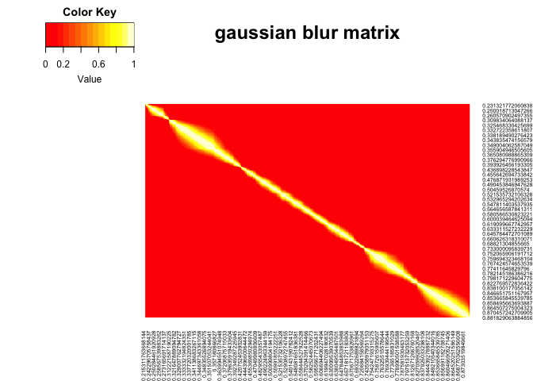
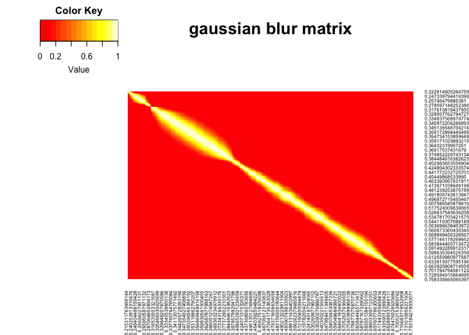

Step2: Calculate Expression Similarities
================
Yiqun Wang

In this example, we will Calculate the expression similarities between
enriched genes identified from step 1 in the zebrafish notochord and
hatching gland. Similarities will be calculated with several different
metrics and stored in a MIMIR object.

``` r
source("../functions/expression_similarity_calculations.R")
source("../functions/MIMIR_obj.R")
```

## Read in expression matrix for notochord and hatching gland

The expression matrices were extracted from the URD reconstructed
transcriptional trajectories for hatching gland and notochord from 3 to
24 hpf. The trajectory data (URD object DraftTree.rds) can be found in
the example\_data folder. Cell names in the expression matrices are
replaced with their pseudotimes.

``` r
## read in read normalized log scaled expression for notochord (noto) and hatching gland (pcp, prechordal plate)
noto.exp = read.csv("../example_data/notochord_GeneByPseudotime.csv",as.is = T, stringsAsFactors = F,check.names = F,row.names = 1)
pcp.exp = read.csv("../example_data/hatching_gland_GeneByPseudotime.csv",as.is = T, stringsAsFactors = F,check.names = F,row.names = 1)
```

## Create an object to store expression data and similarities

``` r
noto.obj <- createMIMIR(name="Notochord", exp.data=as.matrix(noto.exp))
pcp.obj <- createMIMIR(name="Hatching Gland", exp.data=as.matrix(pcp.exp))

noto.obj
```

    ## MIMIR object for Notochord with temporal information: 806 genes x 1221 cells.

``` r
pcp.obj
```

    ## MIMIR object for Hatching Gland with temporal information: 802 genes x 1343 cells.

## Calculate expression distances using a few different methods

``` r
## results will be stored in 3D arrarys (gene x gene x method)
### Hatching gland
pcp.obj@exp.dis <- exp_dis(x=pcp.obj@exp.data, methods=c("cosine", "soft_cosine", "euclidean", "JS"), 
                       smooth=F, pt=pcp.obj@pseudotime, sd = 0.01, cutoff=4,
                       plot_blur = T, verbose = T)
```

    ## [1] "Calculating gaussian blur matrix for soft_cosine and/or expression smoothing..."

    ## [1] "Calculating soft cosine distance..."
    ## [1] "Calculating cosine distance..."
    ## [1] "Calculating euclidean distance..."
    ## [1] "Calculating Jensen-Shannon distance..."

    ## Metric: 'jensen-shannon' using unit: 'log2'; comparing: 802 vectors.

<!-- -->

``` r
### Notochord
noto.obj@exp.dis = exp_dis(x=noto.obj@exp.data, methods=c("cosine", "soft_cosine", "euclidean", "JS"), 
                       smooth=F, pt=noto.obj@pseudotime, sd = 0.01, cutoff=4,
                       plot_blur = T, verbose = T)
```

    ## [1] "Calculating gaussian blur matrix for soft_cosine and/or expression smoothing..."

    ## [1] "Calculating soft cosine distance..."
    ## [1] "Calculating cosine distance..."
    ## [1] "Calculating euclidean distance..."
    ## [1] "Calculating Jensen-Shannon distance..."

    ## Metric: 'jensen-shannon' using unit: 'log2'; comparing: 806 vectors.

<!-- -->

### inspect the structure of the output

``` r
pcp.obj@exp.dis[1:5,1:5,1:3]
```

    ## , , soft_cosine_dist
    ## 
    ##             ABCA3B     ABI1B   ACVR1BA    ADAM8A  ADAMTS18
    ## ABCA3B   0.0000000 0.8936807 0.8375381 0.7384656 0.7063142
    ## ABI1B    0.8936807 0.0000000 0.1056721 0.8848386 0.6128031
    ## ACVR1BA  0.8375381 0.1056721 0.0000000 0.8628227 0.6102929
    ## ADAM8A   0.7384656 0.8848386 0.8628227 0.0000000 0.2383177
    ## ADAMTS18 0.7063142 0.6128031 0.6102929 0.2383177 0.0000000
    ## 
    ## , , cosine_dist
    ## 
    ##                 ABCA3B         ABI1B       ACVR1BA        ADAM8A     ADAMTS18
    ## ABCA3B   -4.440892e-16  9.726512e-01  9.385594e-01  8.967672e-01 9.488657e-01
    ## ABI1B     9.726512e-01 -4.440892e-16  5.749275e-01  9.737731e-01 8.903540e-01
    ## ACVR1BA   9.385594e-01  5.749275e-01 -2.220446e-16  9.246209e-01 8.658833e-01
    ## ADAM8A    8.967672e-01  9.737731e-01  9.246209e-01 -4.440892e-16 7.042596e-01
    ## ADAMTS18  9.488657e-01  8.903540e-01  8.658833e-01  7.042596e-01 1.110223e-16
    ## 
    ## , , euclidean_dist
    ## 
    ##            ABCA3B    ABI1B  ACVR1BA   ADAM8A ADAMTS18
    ## ABCA3B    0.00000 21.89891 42.82844 36.37642 24.19299
    ## ABI1B    21.89891  0.00000 37.67716 39.25130 26.19430
    ## ACVR1BA  42.82844 37.67716  0.00000 52.54017 44.06970
    ## ADAM8A   36.37642 39.25130 52.54017  0.00000 35.40899
    ## ADAMTS18 24.19299 26.19430 44.06970 35.40899  0.00000

## Convert expression distances to similarities

``` r
## Notochord
noto.obj@exp.sim=all_dist_to_sim(noto.obj@exp.dis, max.score = 0.95)

## Hatching gland
pcp.obj@exp.sim=all_dist_to_sim(pcp.obj@exp.dis, max.score = 0.95)

## inspect  output
pcp.obj@exp.sim[1:5,1:5,1:3]
```

    ## , , soft_cosine_sim
    ## 
    ##             ABCA3B     ABI1B   ACVR1BA    ADAM8A  ADAMTS18
    ## ABCA3B   0.9500000 0.1010033 0.1543388 0.2484577 0.2790015
    ## ABI1B    0.1010033 0.9500000 0.8496115 0.1094033 0.3678370
    ## ACVR1BA  0.1543388 0.8496115 0.9500000 0.1303184 0.3702218
    ## ADAM8A   0.2484577 0.1094033 0.1303184 0.9500000 0.7235982
    ## ADAMTS18 0.2790015 0.3678370 0.3702218 0.7235982 0.9500000
    ## 
    ## , , cosine_sim
    ## 
    ##              ABCA3B      ABI1B    ACVR1BA     ADAM8A   ADAMTS18
    ## ABCA3B   0.95000000 0.02598141 0.05836856 0.09807121 0.04857756
    ## ABI1B    0.02598141 0.95000000 0.40381888 0.02491556 0.10416367
    ## ACVR1BA  0.05836856 0.40381888 0.95000000 0.07161018 0.12741090
    ## ADAM8A   0.09807121 0.02491556 0.07161018 0.95000000 0.28095335
    ## ADAMTS18 0.04857756 0.10416367 0.12741090 0.28095335 0.95000000
    ## 
    ## , , euclidean_sim
    ## 
    ##             ABCA3B     ABI1B   ACVR1BA    ADAM8A  ADAMTS18
    ## ABCA3B   0.9500000 0.8638481 0.7815099 0.8068926 0.8548231
    ## ABI1B    0.8638481 0.9500000 0.8017754 0.7955826 0.8469498
    ## ACVR1BA  0.7815099 0.8017754 0.9500000 0.7433033 0.7766267
    ## ADAM8A   0.8068926 0.7955826 0.7433033 0.9500000 0.8106985
    ## ADAMTS18 0.8548231 0.8469498 0.7766267 0.8106985 0.9500000

``` r
range(pcp.obj@exp.sim)
```

    ## [1] 0.00 0.95

## Save the MIMIR objects with the expression matrices and gene expression similarities

``` r
saveRDS(noto.obj, "../example_results/noto_mimir.rds")
saveRDS(pcp.obj, "../example_results/hg_mimir.rds")
```
