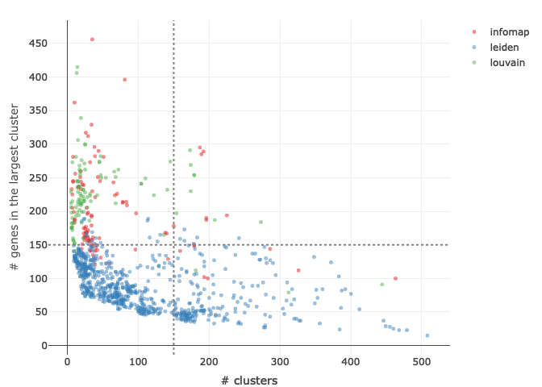
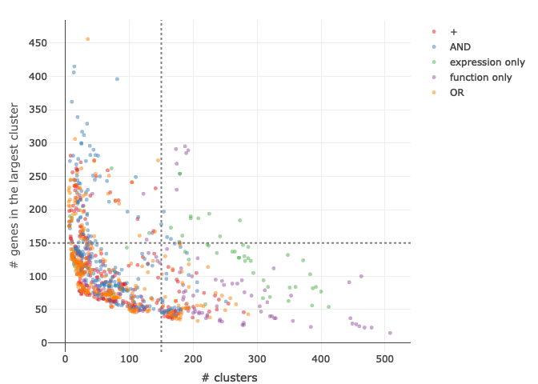
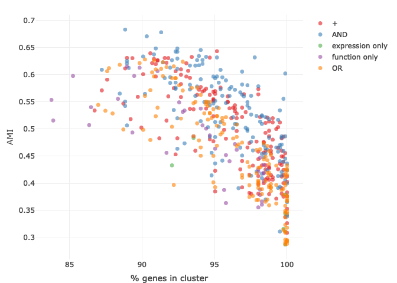
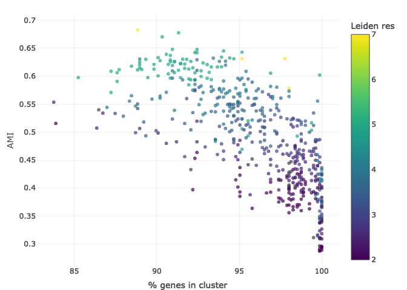

Step5: Check clustering results
================
Yiqun Wang

In this example, we will examine several metrics of the clustering
results obtained from Step4, such as number of clusters, number of
member genes in clusters, and the agreement between clustering results
and manual curation for a subset of notochord genes.

## Load clustering results

``` r
clus_noto=readRDS("../example_results/notochord_all_clusters.rds")
head(clus_noto$`string_noDB+GO+Reactome+Interpro:OR:soft_cos`) # entries in the list are named after the similarity metirc used in clustering. column names in the table reflects clustering methods and parameters
```

    ##         louvain infomap leiden_2_RBConfigurationVertex
    ## ABHD15A       1       3                              1
    ## ACBD3         5       1                              3
    ## ACKR4B        1       3                              1
    ## ACSBG2        4       4                              5
    ## ACTB2         5       1                              3
    ## ACVR1BA       4       6                              9
    ##         leiden_2.5_RBConfigurationVertex leiden_3_RBConfigurationVertex
    ## ABHD15A                                1                              1
    ## ACBD3                                  4                             14
    ## ACKR4B                                 1                              1
    ## ACSBG2                                12                             13
    ## ACTB2                                  4                              4
    ## ACVR1BA                                7                              9
    ##         leiden_3.5_RBConfigurationVertex leiden_4_RBConfigurationVertex
    ## ABHD15A                                1                              1
    ## ACBD3                                 18                             18
    ## ACKR4B                                 1                              1
    ## ACSBG2                                16                             17
    ## ACTB2                                  4                              4
    ## ACVR1BA                                8                              7
    ##         leiden_5_RBConfigurationVertex leiden_7_RBConfigurationVertex
    ## ABHD15A                              3                              2
    ## ACBD3                               27                             18
    ## ACKR4B                               5                              1
    ## ACSBG2                              20                             13
    ## ACTB2                                8                             78
    ## ACVR1BA                              2                              4

## Load manually curated notochord enriched gene subset (300 out of 806 genes)

Genes in this test subset were grouped into modules manually by
inspecting their gene expression, functional annotations, and
literature. 11 genes were not assigned to any module due to a lack of
functional information and no strong expression similarity with other
annotated genes. 289 genes were assigned to 55 modules in this test.

``` r
module_subset=read.csv("../example_data/curated_subset300.csv",stringsAsFactors = F)
head(module_subset)
```

    ##       gene        module level   color
    ## 1      DAP   Apoptosis_1     1 #9E0142
    ## 2     FADD   Apoptosis_1     1 #9E0142
    ## 3    SESN3   Apoptosis_1     1 #9E0142
    ## 4 GADD45BB   Apoptosis_2     2 #A80C44
    ## 5  ZNF385B   Apoptosis_2     2 #A80C44
    ## 6   CD151L Cell_adhesion     3 #B21746

## Calculate some quality metrics for each clustering result

For each clustering result, we will calculate 1. number of clusters, 2.
number of singlets, 3. number of genes in the largets cluster, 4.
percent enriched genes in non-singlet clusters, as well as the AMI score
which measures the agreement between the clustering result and the
manually curated modules for the 289 test gene subset. AMI is a metric
of partition agreement, which returns a value of 1 when two partitions
are identical, while random partitions score 0 on average.

``` r
library(mclust)
```

    ## Package 'mclust' version 5.4.7
    ## Type 'citation("mclust")' for citing this R package in publications.

``` r
library(aricode)
## define function that calculate AMI and other metrics from the clustering results
comp_par <- function(clus_s, module_tbl){
  g_use=intersect(rownames(clus_s),module_tbl$gene)
  clus_s_sub=clus_s[g_use,,drop=F]
  module_tbl=module_tbl[module_tbl[,"gene"]%in%g_use,]
  ## get number of clusters
  n_clus=apply(clus_s,2,max)
  ## initiate a matrix to store results
  results_m=matrix(0,nrow=4,ncol=length(n_clus))
  colnames(results_m)=colnames(clus_s) #each column in clus_s is cluster membership from a clustering method
  rownames(results_m)=c("AMI","n_cluster","n_singlet","max_cluster")
  for(c in colnames(results_m)){
    ## calculate AMI
    results_m["AMI",c]=AMI(module_tbl[,'level'], clus_s_sub[module_tbl[,'gene'],c])
    ## fill in other metrics
    n_memb=table(clus_s[,c])
    results_m[c("n_singlet","max_cluster"),c]=c(sum(n_memb==1),max(n_memb))
    results_m["n_cluster",c]=n_clus[c]
  }
  return(results_m)
}

## To compare performance with different modes of similarities (exp, func, or combined), get the names of expression and functional similarities used
## Expression similarity scores:
exp_sim = readRDS("../example_results/exp_similarities.rds")
exp_sim=exp_sim$noto
exp_sim_names=dimnames(exp_sim)[[3]]
## Functional similarity scores:
anno_sim = readRDS("../example_results/notochord_functional_similarities.RDS")
anno_sim_names = dimnames(anno_sim)[[3]]

## Construct a table for all the metrics
assess_tbl<-data.frame(row.names = c("AMI","n_cluster","n_singlet","max_cluster", "similarity","similarity_mode",
                                     "anno_mode", "cluster_method","leiden_res"), stringsAsFactors = F)

assess_tbl=t(assess_tbl)
for(s in names(clus_noto)){
  add_tbl=as.data.frame(t(comp_par(clus_noto[[s]], module_subset)))
  add_tbl$similarity=s
  if(grepl(":", s,fixed = T)){
    #functional and expression similarities were combined
    scores=unlist(strsplit(s,":"))
    add_tbl$similarity_mode=scores[2]
    #whether single or a combination of functional databases were used
    if(grepl("+", scores[1],fixed=T)){
      add_tbl$anno_mode="combined" 
    }else{add_tbl$anno_mode="single"}
  }else{
    #only functional or only expression similarities were used
    if(s%in%anno_sim_names){
      add_tbl$similarity_mode="function only"
      if(grepl("+", s,fixed=T)){
        add_tbl$anno_mode="combined"
        }else{add_tbl$anno_mode="single"}
    }else if(s%in%exp_sim_names){
      add_tbl$similarity_mode="expression only"
      add_tbl$anno_mode="none"
    }else{
      print(s)
      next
    }
  }
  clus_m=strsplit(rownames(add_tbl),"_")
  add_tbl$cluster_method=unlist(lapply(clus_m,function(x) x[1]))
  add_tbl$leiden_res=unlist(lapply(clus_m,function(x) as.numeric(x[2])))
  rownames(add_tbl)=1:nrow(add_tbl)
  assess_tbl=rbind(assess_tbl,add_tbl)
}

n_genes=dim(clus_noto[[1]])[1]
assess_tbl$pct_cover=(n_genes-assess_tbl$n_singlet)/n_genes*100
```

## Plot the metris

### Plot the number of clusters and size of max cluster

``` r
library(plotly)
```

    ## Loading required package: ggplot2

    ## 
    ## Attaching package: 'plotly'

    ## The following object is masked from 'package:ggplot2':
    ## 
    ##     last_plot

    ## The following object is masked from 'package:stats':
    ## 
    ##     filter

    ## The following object is masked from 'package:graphics':
    ## 
    ##     layout

``` r
vline <- function(x = 0, color = "grey") {
  list(
    type = "line",
    y0 = 0,
    y1 = 1,
    yref = "paper",
    x0 = x,
    x1 = x,
    line = list(color = color, dash="dot")
  )
}

hline <- function(y = 0, color = "grey") {
  list(
    type = "line",
    x0 = 0,
    x1 = 1,
    xref = "paper",
    y0 = y,
    y1 = y,
    line = list(color = color, dash="dot")
  )
}

fig <- plot_ly(x=assess_tbl$n_cluster, y=assess_tbl$max_cluster, type="scatter", mode="markers", text = assess_tbl$similarity, color = assess_tbl$cluster_method, marker = list(opacity = 0.5,size=5),colors="Set1")
fig <- fig %>% layout(xaxis = list(title="# clusters"), 
                      yaxis = list(title="# genes in the largest cluster"),shapes = list(vline(150), hline(150)))

fig
```

<!-- -->

``` r
fig <- plot_ly(x=assess_tbl$n_cluster, y=assess_tbl$max_cluster, type="scatter", mode="markers", text = assess_tbl$similarity, color = assess_tbl$similarity_mode, marker = list(opacity = 0.5,size=5),colors="Set1")
fig <- fig %>% layout(xaxis = list(title="# clusters"), 
                      yaxis = list(title="# genes in the largest cluster"),shapes = list(vline(150), hline(150)))
fig
```

<!-- -->

### Plot percentage of enriched gene in clusters vs AMI or ARI

Only include clustering results with reasonable \# clusters (&lt;150)
and size of largets cluster (&lt;150 genes)

``` r
assess_tbl2=assess_tbl[assess_tbl$n_cluster<150,]
assess_tbl2=assess_tbl2[assess_tbl2$max_cluster<150,]

fig <- plot_ly(x=assess_tbl2$pct_cover, y=assess_tbl2$AMI, type="scatter", mode="markers", text = assess_tbl2$similarity, 
               marker = list(opacity = 0.6,size=7), color = assess_tbl2$similarity_mode, colors='Set1')
fig <- fig %>% layout(xaxis = list(title="% genes in cluster"), 
                      yaxis = list(title="AMI"))
fig
```

<!-- -->

``` r
fig <- plot_ly(x=assess_tbl2$pct_cover, y=assess_tbl2$AMI, type="scatter", mode="markers", text = assess_tbl2$similarity, marker = list(opacity = 0.7,size=6,colorbar = list(title = "Leiden res"),color = assess_tbl2$leiden_res, colorscale='Viridis'))
fig <- fig %>% layout(xaxis = list(title="% genes in cluster"), 
                      yaxis = list(title="AMI"))

fig
```

<!-- -->

## Pick a clustering result as the basis for module curation

``` r
s_use=intersect(which(assess_tbl2$pct_cover>90), which(assess_tbl2$AMI>0.65))
assess_tbl2[s_use,]
```

    ##           AMI n_cluster n_singlet max_cluster
    ## 449 0.6704556       121        78          50
    ## 467 0.6777031       116        70          49
    ##                                       similarity similarity_mode anno_mode
    ## 449   string_noDB+GO+Reactome+Interpro:AND:jsdis             AND  combined
    ## 467 string_ExpTxt+GO+Reactome+Interpro:AND:jsdis             AND  combined
    ##     cluster_method leiden_res pct_cover
    ## 449         leiden          5  90.32258
    ## 467         leiden          5  91.31514

``` r
clus_use=clus_noto[[assess_tbl2$similarity[s_use[1]]]]

## convert the selected cluster result into a list, with each entry containing the member genes of a cluster
clus_col=grep("leiden_5",colnames(clus_use))
clus_use=clus_use[,clus_col]
auto_module=list("notochord"=list(),"hatching_gland"=list())
for(i in unique(clus_use)){
  genes.i=names(which(clus_use==i))
  if(length(genes.i)>1){
    auto_module[['notochord']][['modules']][[paste0('auto_',i)]]=genes.i
  }
}

## save as an rds (can be loaded into the shiny app for manual curation)
saveRDS(auto_module,"../example_results//Cluster_basis_for_Curation.rds")
```
