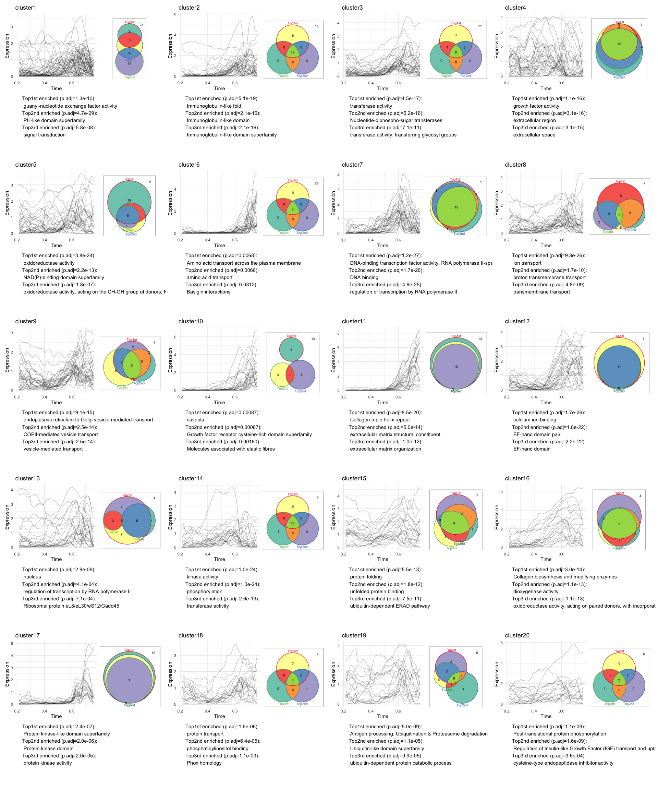
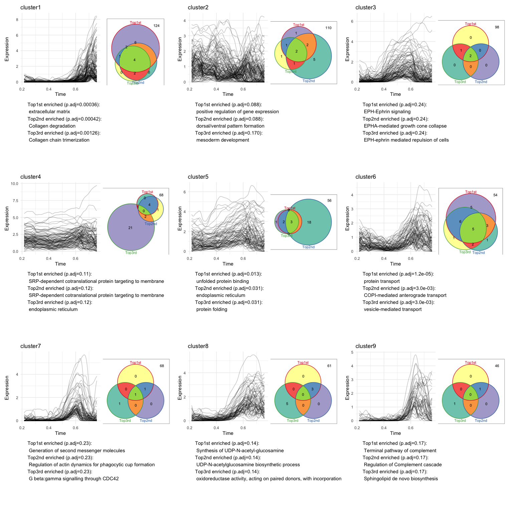
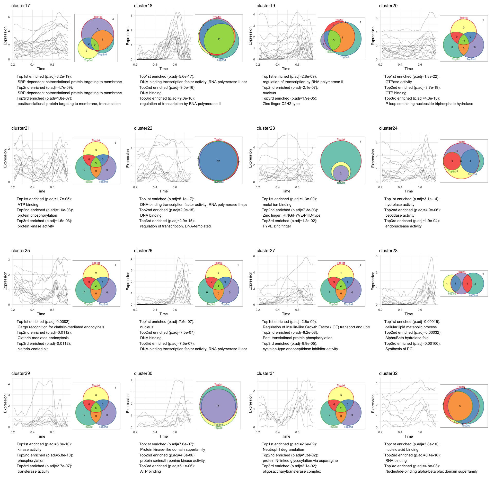
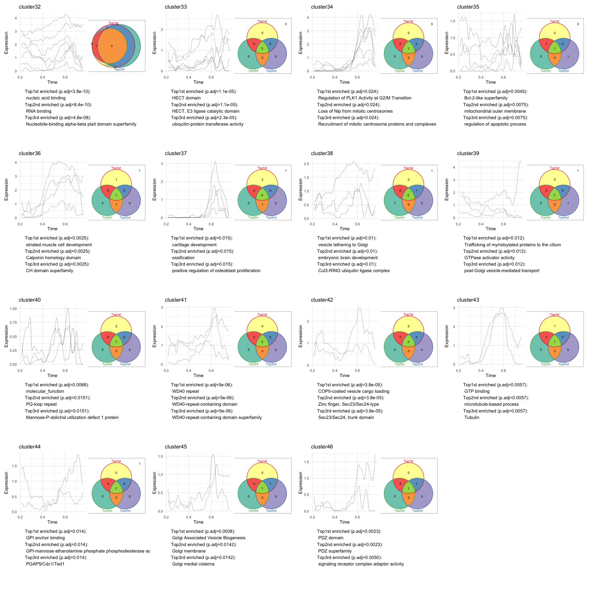

Step5: Check clustering results
================
Yiqun Wang

In this example, we will examine several metrics of the clustering
results obtained from Step4, such as number of clusters, number of
member genes in clusters, and the agreement between clustering results
and manual curation for a subset of notochord genes.

``` r
source("../functions/MIMIR_obj.R")
source("../functions/cluster_evaluation.R")
```

# 1 Load previous results

``` r
noto.obj <- readRDS("../example_results/noto_mimir.rds")
```

# 2 Load manually curated notochord enriched gene subset (300 out of 806 genes)

Genes in this test subset were grouped into modules manually by
inspecting their gene expression, functional annotations, and
literature. 11 genes were not assigned to any module due to a lack of
functional information and no strong expression similarity with other
annotated genes. 289 genes were assigned to 55 modules in this test.

``` r
module_subset=read.csv("../example_data/curated_subset300.csv",stringsAsFactors = F)
head(module_subset)
```

    ##       gene        module level   color
    ## 1      DAP   Apoptosis_1     1 #9E0142
    ## 2     FADD   Apoptosis_1     1 #9E0142
    ## 3    SESN3   Apoptosis_1     1 #9E0142
    ## 4 GADD45BB   Apoptosis_2     2 #A80C44
    ## 5  ZNF385B   Apoptosis_2     2 #A80C44
    ## 6   CD151L Cell_adhesion     3 #B21746

## 2.1 Calculate some quality metrics for each clustering result

For each clustering result, we will calculate 1. number of clusters, 2.
number of singlets, 3. number of genes in the largets cluster, 4.
percent enriched genes in non-singlet clusters, as well as the AMI score
which measures the agreement between the clustering result and the
manually curated modules for the 289 test gene subset. AMI is a metric
of partition agreement, which returns a value of 1 when two partitions
are identical, while random partitions score 0 on average.

### 2.1.1 Annotations from additional databases can be used for cross validation

Here we use annotation tables obtained from MSigDB
(<https://www.gsea-msigdb.org/gsea/msigdb/human/collections.jsp>) for
cross checking the results

``` r
msigdb_c2 <- read.table("../example_data/msigdbr_C2_CGP.txt", header = 1, stringsAsFactors = F,sep = "\t") #Gene sets represent expression signatures of genetic and chemical perturbations (human data). 

#reduce to include only the genes in the embryo (union of notochord and background genes)
pcp.genes=scan("../example_results/genes.pcp.txt",what="character") #genes enriched in the hatching gland (calculated in step1). 
bg.genes=scan("../example_data/genes.bg.2x.txt", what="character") #union of genes enriched in all other cell types
msigdb_c2=msigdb_c2[which(msigdb_c2$gene%in%union(noto.obj@genes, bg.genes)),]
head(msigdb_c2)
```

    ##      gene                       id
    ## 1   AHNAK ABBUD_LIF_SIGNALING_1_DN
    ## 2  ALCAMB ABBUD_LIF_SIGNALING_1_DN
    ## 3 ANKRD40 ABBUD_LIF_SIGNALING_1_DN
    ## 4   CAPN9 ABBUD_LIF_SIGNALING_1_DN
    ## 5  CYFIP1 ABBUD_LIF_SIGNALING_1_DN
    ## 6  DCAF11 ABBUD_LIF_SIGNALING_1_DN
    ##                                                                                       description
    ## 1 Genes down-regulated in AtT20 cells (pituitary cancer) after  treatment with LIF [GeneID=3976].
    ## 2 Genes down-regulated in AtT20 cells (pituitary cancer) after  treatment with LIF [GeneID=3976].
    ## 3 Genes down-regulated in AtT20 cells (pituitary cancer) after  treatment with LIF [GeneID=3976].
    ## 4 Genes down-regulated in AtT20 cells (pituitary cancer) after  treatment with LIF [GeneID=3976].
    ## 5 Genes down-regulated in AtT20 cells (pituitary cancer) after  treatment with LIF [GeneID=3976].
    ## 6 Genes down-regulated in AtT20 cells (pituitary cancer) after  treatment with LIF [GeneID=3976].

### 2.1.2 Calculate some stats for each clustering result

The calculated stats and the clustering parameters will be stored in a
dataframe (returned as a data.frame if `return_df_only=T`, or as a slot
in the resulting mimir object if `return_df_only=F`).

``` r
noto.obj=assess_result(noto.obj, manual_modules=module_subset, return_df_only=F, 
                       internal_db_use="GO", go_cat=c("BP","MF"), external_db_tbl=msigdb_c2) # calculating annotation enrichment can be slow if the gene annotation table used as internal_db_use or external_db_tbl are large (due to a large number of annotation terms to test).
```

### 2.1.3 Save the object with the cluster stats added

``` r
saveRDS(noto.obj, "../example_results/noto_mimir.rds")
```

## 2.2 Plot the metrics

``` r
noto.obj <- readRDS("../example_results/noto_mimir.rds")
head(noto.obj@cluster_metrics)
```

    ##   n_cluster n_singlet max_cluster intra_mean_exp_cor pct_gene_in_cluster
    ## 1         6         0         199          0.1235901           100.00000
    ## 2         8         0         242          0.1272109           100.00000
    ## 3        10         1         152          0.1319605            99.87593
    ## 4        17         0         121          0.1262920           100.00000
    ## 5        24         0         100          0.1273475           100.00000
    ## 6        75        40          61          0.1302524            95.03722
    ##                                       similarity similarity_mode
    ## 1 STRING+GO+Reactome+Interpro:OR:soft_cosine_sim              OR
    ## 2 STRING+GO+Reactome+Interpro:OR:soft_cosine_sim              OR
    ## 3 STRING+GO+Reactome+Interpro:OR:soft_cosine_sim              OR
    ## 4 STRING+GO+Reactome+Interpro:OR:soft_cosine_sim              OR
    ## 5 STRING+GO+Reactome+Interpro:OR:soft_cosine_sim              OR
    ## 6 STRING+GO+Reactome+Interpro:OR:soft_cosine_sim              OR
    ##                      anno_sim         exp_sim cluster_method leiden_res
    ## 1 STRING+GO+Reactome+Interpro soft_cosine_sim        louvain         NA
    ## 2 STRING+GO+Reactome+Interpro soft_cosine_sim        infomap         NA
    ## 3 STRING+GO+Reactome+Interpro soft_cosine_sim         leiden          2
    ## 4 STRING+GO+Reactome+Interpro soft_cosine_sim         leiden          3
    ## 5 STRING+GO+Reactome+Interpro soft_cosine_sim         leiden          4
    ## 6 STRING+GO+Reactome+Interpro soft_cosine_sim         leiden          5
    ##         AMI GO_mean(-logP) GO_median(-logP) msigdb_c2_mean(-logP)
    ## 1 0.2225899       3.931354         3.382356             11.065687
    ## 2 0.2392195       5.044163         3.480605              9.475788
    ## 3 0.2975290       6.324193         5.198687              8.202428
    ## 4 0.3673374       8.135513         4.900732              5.001742
    ## 5 0.4236666       9.273131         3.605182              4.749378
    ## 6 0.5208792       9.129144         3.557339              3.703179
    ##   msigdb_c2_median(-logP) msigdb_c3_mean(-logP) msigdb_c3_median(-logP)
    ## 1                6.773925             0.6811111               0.5031164
    ## 2                3.856041             1.0775980               0.9063681
    ## 3                6.995219             0.5168884               0.2301706
    ## 4                3.699504             1.0145230               0.7123764
    ## 5                4.183045             1.0396356               0.8611840
    ## 6                3.220099             0.9955806               0.9333519

### 2.2.1 Plot the number of clusters and size of max cluster

``` r
plotly_scatter(noto.obj@cluster_metrics, x="n_cluster", y="max_cluster",color="similarity_mode", hover_text = "similarity", 
               addline_x = 150, addline_y = 150, figsize = c(500,400)) 
```

    ## Warning: Specifying width/height in layout() is now deprecated.
    ## Please specify in ggplotly() or plot_ly()

<!-- -->

``` r
# good results should have a reasonable number of clusters (<150) and without most genes ending up in a single cluster (max cluster size <150)
plotly_scatter(noto.obj@cluster_metrics, x="n_cluster", y="max_cluster",color="cluster_method", hover_text = "similarity",
               addline_x = 150, addline_y = 150, figsize = c(500,400))
```

    ## Warning: Specifying width/height in layout() is now deprecated.
    ## Please specify in ggplotly() or plot_ly()

<!-- -->

### 2.2.2 Plot percentage of enriched gene in clusters vs agreement with manual curation (AMI)

Only keep the clustering results with reasonable \# clusters (&lt;150)
and size of the largest cluster (&lt;150 genes).

``` r
metric_tbl=noto.obj@cluster_metrics
metric_tbl=metric_tbl[metric_tbl$n_cluster<150,]
metric_tbl=metric_tbl[metric_tbl$max_cluster<150,]

plotly_scatter(metric_tbl, x="pct_gene_in_cluster", y="AMI",color="similarity_mode", hover_text = "similarity", 
               addline_x = 90, addline_y = 0.6, figsize = c(500,350)) 
```

    ## Warning: Specifying width/height in layout() is now deprecated.
    ## Please specify in ggplotly() or plot_ly()

<!-- -->

``` r
plotly_scatter(metric_tbl, x="pct_gene_in_cluster", y="AMI",color="cluster_method", hover_text = "similarity", 
               addline_x = 90, addline_y = 0.6, figsize = c(500,350))
```

    ## Warning: Specifying width/height in layout() is now deprecated.
    ## Please specify in ggplotly() or plot_ly()

<!-- -->

### 2.2.3 Pick a clustering result as the starting point for gene module curation

Only consider the results with &gt;90% genes in non-singlet clusters.
Pick the result with the highest agreement with the gene subset manual
curation.

``` r
metric_use=metric_tbl[metric_tbl$pct_gene_in_cluster>90,]
metric_use=metric_use[order(metric_use[["AMI"]], decreasing = T),][1,]
metric_use
```

    ##     n_cluster n_singlet max_cluster intra_mean_exp_cor pct_gene_in_cluster
    ## 215       131        77          52         0.09950561            90.44665
    ##                                             similarity similarity_mode
    ## 215 STRING_ExpTxt+GO_noCC+Reactome+Interpro:AND:JS_sim             AND
    ##                                    anno_sim exp_sim cluster_method leiden_res
    ## 215 STRING_ExpTxt+GO_noCC+Reactome+Interpro  JS_sim         leiden          6
    ##           AMI GO_mean(-logP) GO_median(-logP) msigdb_c2_mean(-logP)
    ## 215 0.6796704       17.65517         8.828408              4.204717
    ##     msigdb_c2_median(-logP) msigdb_c3_mean(-logP) msigdb_c3_median(-logP)
    ## 215                3.408128              1.435163                1.253541

### 2.2.4 Store this clustering result in the `@gene.info` slot in the MIMIR object for convinient access

``` r
noto.obj<-add_cluster_result(noto.obj, metric_use)
head(noto.obj@gene.info)
```

    ##         weighted.time
    ## ABHD15A     0.5600348
    ## ACBD3       0.4862443
    ## ACKR4B      0.7338631
    ## ACSBG2      0.5232356
    ## ACTB2       0.4764189
    ## ACVR1BA     0.4274386
    ##         STRING_ExpTxt+GO_noCC+Reactome+Interpro:AND:JS_sim;leiden_6_RBConfigurationVertex
    ## ABHD15A                                                                                28
    ## ACBD3                                                                                  33
    ## ACKR4B                                                                                 10
    ## ACSBG2                                                                                 28
    ## ACTB2                                                                                  81
    ## ACVR1BA                                                                                92
    ##         GO+Reactome+Interpro:OR:soft_cosine_sim;leiden_2_RBConfigurationVertex
    ## ABHD15A                                                                      1
    ## ACBD3                                                                        4
    ## ACKR4B                                                                       1
    ## ACSBG2                                                                       6
    ## ACTB2                                                                        4
    ## ACVR1BA                                                                      2
    ##         STRING_ExpTxt+GO_noCC+Reactome+Interpro:+:soft_cosine_sim;leiden_6_RBConfigurationVertex
    ## ABHD15A                                                                                       28
    ## ACBD3                                                                                          9
    ## ACKR4B                                                                                         1
    ## ACSBG2                                                                                        28
    ## ACTB2                                                                                         20
    ## ACVR1BA                                                                                       86

### 2.2.5 Other metrics and plots can be checked to assist the decision on which similarity scores and clustering parameters to use

For instance, expression coherence within each cluster can be measured
by the mean correlations between genes in the cluster. Functional
coherence can be checked with additional functional annotation data that
wasn’t used in our previous functional similarity calculations.

#### 2.2.5.1 Cross check with the C2 gene annotations from MSigDB

For details on MSigDB C2, see
<https://www.gsea-msigdb.org/gsea/msigdb/human/collections.jsp>. These
annotations represent expression signatures of genes in genetic and
chemical perturbations. We used enrichment test to identify the most
significantly enriched MSigDB C2 annotations in each MIMIR cluster, and
took the mean -log(p-value) of the most enriched annotations across
clusters to estimate how MIMIR clusters represent functional gene sets.

``` r
metric_tbl=noto.obj@cluster_metrics
metric_tbl=metric_tbl[metric_tbl$n_cluster<150,]
metric_tbl=metric_tbl[metric_tbl$max_cluster<150,]
metric_tbl=metric_tbl[metric_tbl$pct_gene_in_cluster>90,]
bestxy=c(metric_use[,'msigdb_c2_median(-logP)'], y=metric_use[,'intra_mean_exp_cor'])
fig <- plotly_scatter(metric_tbl, x="msigdb_c2_median(-logP)", y="intra_mean_exp_cor",color="AMI", hover_text = "similarity", 
               color_pal = 'viridis', marker_size = 7, figsize = c(500,350))
```

    ## Warning: Specifying width/height in layout() is now deprecated.
    ## Please specify in ggplotly() or plot_ly()

``` r
fig %>% add_trace(type = 'scatter', mode = 'markers', x = bestxy[1], y = bestxy[2],color='',
                  marker = list(size = 12, symbol = 'circle-open', color="coral"), showlegend = FALSE)
```

<!-- -->

``` r
plotly_scatter(metric_tbl, x="msigdb_c2_median(-logP)", y="intra_mean_exp_cor",color="similarity_mode", hover_text = "similarity", 
                      marker_size = 7, figsize = c(500,350))
```

    ## Warning: Specifying width/height in layout() is now deprecated.
    ## Please specify in ggplotly() or plot_ly()

<!-- -->

``` r
fig <- plotly_scatter(metric_tbl, x="msigdb_c2_median(-logP)", y="intra_mean_exp_cor",color="n_cluster", hover_text = "similarity", 
               color_pal = 'viridis', marker_size = 7, figsize = c(500,350))
```

    ## Warning: Specifying width/height in layout() is now deprecated.
    ## Please specify in ggplotly() or plot_ly()

``` r
fig %>% add_trace(type = 'scatter', mode = 'markers', x = bestxy[1], y = bestxy[2],color='',
                  marker = list(size = 12, symbol = 'circle-open', color="coral"), showlegend = FALSE)
```

<!-- -->

*The previously picked ‘best’ clustering result is circled (red) on the
plot.* *Some clustering results with high MSigDB C2 term enrichment
(upper right points on plot) exhibit low agreement with manually curated
gene subsets, as well as low cluster numbers. It is likely that these
clustering results contained large clusters that combined genes from
several functions.*

#### 2.2.5.2 Check with C3 annotation from MSigDB

MSigDB C3 annotate genes based on shared GTRD predicted transcription
factor binding sites in the region -1000,+100 bp around the TSS.

``` r
msigdb_c3 <- read.table("../example_data/msigdbr_C3_TFT-GTRD.txt", header = 1, stringsAsFactors = F,sep = "\t") 
msigdb_c3=msigdb_c3[which(msigdb_c3$gene%in%union(noto.obj@genes, bg.genes)),]
head(msigdb_c3)
noto.obj <- add_external_assess(noto.obj, return_df_only=F, external_db_tbl=msigdb_c3) 
saveRDS(noto.obj, "../example_results/noto_mimir.rds")
```

``` r
noto.obj <- readRDS("../example_results/noto_mimir.rds")
```

``` r
metric_tbl=noto.obj@cluster_metrics
metric_tbl=metric_tbl[metric_tbl$n_cluster<150,]
metric_tbl=metric_tbl[metric_tbl$max_cluster<150,]
metric_tbl=metric_tbl[metric_tbl$pct_gene_in_cluster>90,]
metric_use=metric_tbl[metric_tbl$pct_gene_in_cluster>90,]
metric_use=metric_use[order(metric_use[["AMI"]], decreasing = T),][1,]
bestxy=c(metric_use[,'msigdb_c3_median(-logP)'], y=metric_use[,'intra_mean_exp_cor'])
fig <- plotly_scatter(metric_tbl, x="msigdb_c3_median(-logP)", y="intra_mean_exp_cor",color="AMI", hover_text = "similarity", 
               color_pal = 'viridis', marker_size = 7, figsize = c(500,350))
```

    ## Warning: Specifying width/height in layout() is now deprecated.
    ## Please specify in ggplotly() or plot_ly()

``` r
fig %>% add_trace(type = 'scatter', mode = 'markers', x = bestxy[1], y = bestxy[2],color='',
                  marker = list(size = 12, symbol = 'circle-open', color="coral"), showlegend = FALSE)
```

<!-- -->

``` r
plotly_scatter(metric_tbl, x="msigdb_c3_median(-logP)", y="intra_mean_exp_cor",color="similarity_mode", hover_text = "similarity", 
                      marker_size = 7, figsize = c(500,350))
```

    ## Warning: Specifying width/height in layout() is now deprecated.
    ## Please specify in ggplotly() or plot_ly()

<!-- -->

``` r
fig <- plotly_scatter(metric_tbl, x="msigdb_c3_median(-logP)", y="intra_mean_exp_cor",color="n_cluster", hover_text = "similarity", 
               color_pal = 'viridis', marker_size = 7, figsize = c(500,350))
```

    ## Warning: Specifying width/height in layout() is now deprecated.
    ## Please specify in ggplotly() or plot_ly()

``` r
fig %>% add_trace(type = 'scatter', mode = 'markers', x = bestxy[1], y = bestxy[2],color='',
                  marker = list(size = 12, symbol = 'circle-open', color="coral"), showlegend = FALSE)
```

<!-- -->

### 2.2.6 Inspect gene expression and functional annotations for each cluster

#### 2.2.6.1 Use the previously picked ‘best’ clustering result (highest AMI)

``` r
## Compute a smoothed version of gene expression for visualization (optional)
source("../functions/expression_similarity_calculations.R")
```

    ## 
    ## Attaching package: 'gplots'

    ## The following object is masked from 'package:stats':
    ## 
    ##     lowess

``` r
noto.obj@smoothed.exp=gauss.blur.matrix(noto.obj@exp.data, pt=noto.obj@pseudotime, sd=0.01, return_nn = F) # this can be automatically calculated in the plotClusters function when exp_use="smoothed.exp"
## Use the previously picked 'best' clustering result (stored in the gene.info slot)
cluster_plots = plotClusters(noto.obj, cluster_use="STRING_ExpTxt+GO_noCC+Reactome+Interpro:AND:JS_sim;leiden_6_RBConfigurationVertex",
                             exp_use="smoothed.exp", save_pdf="../example_results/cluster_plots1.pdf", 
                             save_width = 20, save_height = 40, return_plots=T, show_plot=F) ## show_plot=F: full plot is too big to show at once in this notebook
```

    ## Warning in min(which(!fequal(fromdist, 0))): no non-missing arguments to min;
    ## returning Inf

    ## Warning in acos((a^2 + b^2 - cp^2)/(2 * a * b)): NaNs produced

    ## Warning in acos((a^2 + cp^2 - b^2)/(2 * a * cp)): NaNs produced

    ## Warning in acos((cp^2 + b^2 - a^2)/(2 * b * cp)): NaNs produced

*Full plot saved to `../example_results/cluster_plots1.pdf`*

**Visualize cluster plots**

``` r
library(patchwork)
wrap_plots(cluster_plots[1:20], ncol = 4)
```

<!-- -->

``` r
wrap_plots(cluster_plots[21:40], ncol = 4)
```

<!-- -->

``` r
wrap_plots(cluster_plots[41:length(cluster_plots)], ncol = 4)
```

<!-- -->

*This clustering strategy resulted in 54 non-singlet clusters. For each
cluster, traces in the left graph represent expression of each gene in
the cluster. Expression levels are not scaled in this plot, (a scaled
version might show the result better since JS and cosine similarity
calculation is not sensitive to the absolute expression levels). The top
3 most enriched functional annotation terms in a cluster were identified
and the number of annotated genes are shown in the Venn diagrams on the
right. The annotation terms tested are from GO, Reactome, and Interpro
(using data tables stored in `noto.obj@annotations`, saved in step3).
Genes in a cluster that are not annotated by the top 3 annotations are
indicated by the number outside the circles (upper right corner in the
box). In most cases, we observe that **1.** the 3 top annotations are
related or redundant, indicating that they represent the same or related
biological functions; and **2** the majority of genes in a cluster are
covered by the top 3 annotations, indicating that most genes in a
cluster are from the same or related biological processes.*

#### 2.2.6.2 Use the clustering result with high enrichment of MSigDB C2 annotations

(the red circled point in the following plot). MSigDB C2 annotations are
based on expression signatures of genes in genetic and chemical
perturbations.

``` r
fig <- plotly_scatter(metric_tbl, x="msigdb_c2_median(-logP)", y="intra_mean_exp_cor",color="AMI", hover_text = "similarity", 
               color_pal = 'viridis', marker_size = 7, figsize = c(500,350))
```

    ## Warning: Specifying width/height in layout() is now deprecated.
    ## Please specify in ggplotly() or plot_ly()

``` r
best_metric=metric_tbl[intersect(which(metric_tbl$intra_mean_exp_cor>0.14),which(metric_tbl$`msigdb_c2_median(-logP)`>7)),]
bestxy=c(best_metric$`msigdb_c2_median(-logP)`,best_metric$intra_mean_exp_cor)
fig %>% add_trace(type = 'scatter', mode = 'markers', x = bestxy[1], y = bestxy[2],color='',
                  marker = list(size = 15, symbol = 'circle-open', color="coral"), showlegend = FALSE)
```

<!-- -->
**Extract this clustering result and write it to `noto.obj@gene.info`**

``` r
noto.obj<-add_cluster_result(noto.obj, best_metric)
head(noto.obj@gene.info)
```

    ##         weighted.time
    ## ABHD15A     0.5600348
    ## ACBD3       0.4862443
    ## ACKR4B      0.7338631
    ## ACSBG2      0.5232356
    ## ACTB2       0.4764189
    ## ACVR1BA     0.4274386
    ##         STRING_ExpTxt+GO_noCC+Reactome+Interpro:AND:JS_sim;leiden_6_RBConfigurationVertex
    ## ABHD15A                                                                                28
    ## ACBD3                                                                                  33
    ## ACKR4B                                                                                 10
    ## ACSBG2                                                                                 28
    ## ACTB2                                                                                  81
    ## ACVR1BA                                                                                92
    ##         GO+Reactome+Interpro:OR:soft_cosine_sim;leiden_2_RBConfigurationVertex
    ## ABHD15A                                                                      1
    ## ACBD3                                                                        4
    ## ACKR4B                                                                       1
    ## ACSBG2                                                                       6
    ## ACTB2                                                                        4
    ## ACVR1BA                                                                      2
    ##         STRING_ExpTxt+GO_noCC+Reactome+Interpro:+:soft_cosine_sim;leiden_6_RBConfigurationVertex
    ## ABHD15A                                                                                       28
    ## ACBD3                                                                                          9
    ## ACKR4B                                                                                         1
    ## ACSBG2                                                                                        28
    ## ACTB2                                                                                         20
    ## ACVR1BA                                                                                       86

**Generate cluster plot**

``` r
cluster_use="GO+Reactome+Interpro:OR:soft_cosine_sim;leiden_2_RBConfigurationVertex"
cluster_plots = plotClusters(noto.obj, cluster_use=cluster_use, exp_use="smoothed.exp", save_pdf=F, 
                             save_width = 20, save_height = 40, return_plots=T, show_plot=F) 

wrap_plots(cluster_plots[1:length(cluster_plots)], ncol = 3)
```

<!-- -->

*This clustering strategy resulted in only 9 clusters. Each cluster is
big. Gene expression seems relatively consistent withing cluster and
different between clusters. While the top 3 enriched functional
annotation terms are highly related in most clusters, they only cover a
small portion of all genes in each cluster (genes in cluster but not
annotated by the top 3 annotations are indicated by the number outside
the circles in the Venn diagram). This indicates that each cluster
contains genes from diverse biological processes.*

#### 2.2.6.3 Use the clustering result with high enrichment of MSigDB C3 annotations

(the red circled point in the following plot). MSigDB C3 annotate genes
based on shared GTRD predicted transcription factor binding sites in the
region -1000,+100 bp around the TSS.

``` r
best_metric=metric_tbl[intersect(which(metric_tbl$intra_mean_exp_cor>0.11),which(metric_tbl$`msigdb_c3_median(-logP)`>1.7)),]
bestxy=c(best_metric$`msigdb_c3_median(-logP)`,best_metric$intra_mean_exp_cor)

fig <- plotly_scatter(metric_tbl, x="msigdb_c3_median(-logP)", y="intra_mean_exp_cor",color="AMI", hover_text = "similarity", 
               color_pal = 'viridis', marker_size = 7, figsize = c(500,350))
```

    ## Warning: Specifying width/height in layout() is now deprecated.
    ## Please specify in ggplotly() or plot_ly()

``` r
fig %>% add_trace(type = 'scatter', mode = 'markers', x = bestxy[1], y = bestxy[2],color='',
                  marker = list(size = 12, symbol = 'circle-open', color="coral"), showlegend = FALSE)
```

<!-- -->

**Extract this clustering result and write it to `noto.obj@gene.info`**

``` r
noto.obj<-add_cluster_result(noto.obj, best_metric)
head(noto.obj@gene.info)
```

    ##         weighted.time
    ## ABHD15A     0.5600348
    ## ACBD3       0.4862443
    ## ACKR4B      0.7338631
    ## ACSBG2      0.5232356
    ## ACTB2       0.4764189
    ## ACVR1BA     0.4274386
    ##         STRING_ExpTxt+GO_noCC+Reactome+Interpro:AND:JS_sim;leiden_6_RBConfigurationVertex
    ## ABHD15A                                                                                28
    ## ACBD3                                                                                  33
    ## ACKR4B                                                                                 10
    ## ACSBG2                                                                                 28
    ## ACTB2                                                                                  81
    ## ACVR1BA                                                                                92
    ##         GO+Reactome+Interpro:OR:soft_cosine_sim;leiden_2_RBConfigurationVertex
    ## ABHD15A                                                                      1
    ## ACBD3                                                                        4
    ## ACKR4B                                                                       1
    ## ACSBG2                                                                       6
    ## ACTB2                                                                        4
    ## ACVR1BA                                                                      2
    ##         STRING_ExpTxt+GO_noCC+Reactome+Interpro:+:soft_cosine_sim;leiden_6_RBConfigurationVertex
    ## ABHD15A                                                                                       28
    ## ACBD3                                                                                          9
    ## ACKR4B                                                                                         1
    ## ACSBG2                                                                                        28
    ## ACTB2                                                                                         20
    ## ACVR1BA                                                                                       86

**Generate cluster plot**

``` r
cluster_use="STRING_ExpTxt+GO_noCC+Reactome+Interpro:+:soft_cosine_sim;leiden_6_RBConfigurationVertex"
cluster_plots = plotClusters(noto.obj, cluster_use=cluster_use, exp_use="smoothed.exp", save_pdf=F, 
                             save_width = 20, save_height = 40, return_plots=T, show_plot=F) 
```

    ## Warning in acos((a^2 + b^2 - cp^2)/(2 * a * b)): NaNs produced

    ## Warning in acos((cp^2 + b^2 - a^2)/(2 * b * cp)): NaNs produced

    ## Warning in injectEdge(drawing = new1, newEdgeList = new2@edgeList[edgeSet], :
    ## Face 10 has points i34,c11,i35,e22,c21,e22,i35,c11,i33; can't cope well with
    ## joining repeated TO point i35 yet

``` r
wrap_plots(cluster_plots[1:16], ncol = 4)
```

<!-- -->

``` r
wrap_plots(cluster_plots[17:32], ncol = 4)
```

<!-- -->

``` r
wrap_plots(cluster_plots[32:length(cluster_plots)], ncol = 4)
```

<!-- -->

*The “best” clustering result picked based on intra-cluster gene
correlation and MSigDB C3 annotation enrichment is similar to that
picked based on the highest agreement with our manually curated gene
subset. This shows that in absence of curated gold-standard, expression
and functional coherence measured with additional approaches/data
sources (that are not used in calculating the integrated similarity for
clustering) can be used to pick the best clusters for further manual
curation.*

### 2.2.7 Save the best clustering result (based on agreement with manually curated gene subset)

``` r
cluster_use="STRING_ExpTxt+GO_noCC+Reactome+Interpro:AND:JS_sim;leiden_6_RBConfigurationVertex"
auto_module = get_auto_module(noto.obj,cluster_use=cluster_use, name_by_enriched=T, use_description=T)
module2tsv(auto_module, "../example_results/auto_module.tsv")

## save as an rds (can be loaded into the shiny app for manual curation)
saveRDS(auto_module,"../example_results//Cluster_basis_for_Curation.rds")
```
